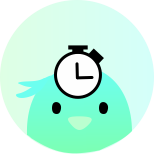
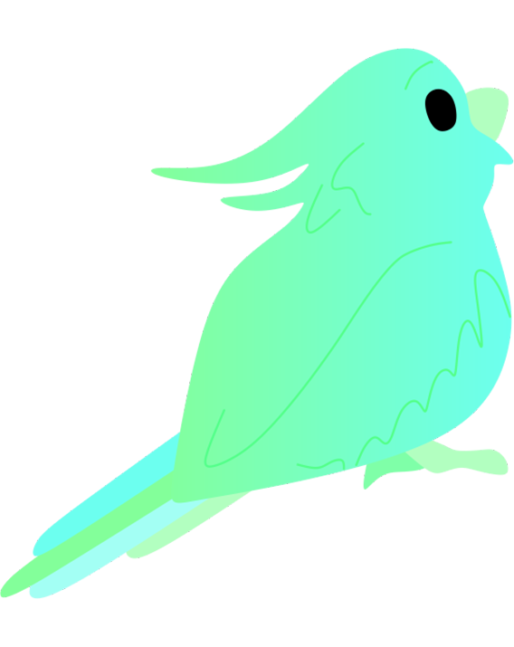

<!-- PROJECT LOGO -->
 

  

  <h3 align="center">Your Timer</h3>
  
March 2023

  

    Кастомизируемый таймер
     
    <a href="https://your-timer.vercel.app/">Проект в Vercel</a>
    ·
    <a href="https://github.com/krabochki/YourTimer/issues">Баги</a>
    ·
    <a href="https://www.linkedin.com/in/polina-kuzmenok-550449291">LinkedIn автора</a>
  

<!-- TABLE OF CONTENTS -->

  
Содержание

  <ol>
    <li><a href="#about">О проекте</a></li>
    <li><a href="#stack">Технологии</a></li>
    <li><a href="#start">Начало разработки</a></li>
    <li><a href="#author">Автор</a></li>
  </ol>

<!-- ABOUT THE PROJECT -->

## О проекте 📢

Проект "Your timer" представляет собой веб-приложение таймера.

Этот таймер можно настраивать самыми разными способами:
- выбирать язык;
- выбирать темную или светлую тему;
- выбирать цветные пресеты;
- выбирать рингтоны;
- настраивать длительность звукового оповещения;
- настраивать громкость звукового оповещения;
- расширять в полный экран.

Красочные анимации (разные на мобильных и компьютерных устройствах) сделают ваше знакомство с Your Timer еще более веселым.
18 персонажей таймера уже вас ждут!

 

(<a href="#readme-top">наверх</a>)

## Технологии ⚙️

- Фреймворк: Angular
- Язык программирования: TypeScript
- IDE: Visual Studio Code

(<a href="#readme-top">наверх</a>)

<!-- GETTING STARTED -->

## Начало разработки 🚀

Запустите команду `npm install` для установки необходимых для разработки зависимостей.

Запустите `ng serve` для начала разработки. Откройте `http://localhost:4200/`. Приложение автоматически перезагрузится, если вы измените какой-либо из исходных файлов.

Запустите `ng build`, чтобы собрать проект. Сборка будет храниться в каталоге `dist/`.

(<a href="#readme-top">наверх</a>)

 

<h3 align="center"> Автор 💡</h3>

  

Автор проекта: Кузьменок Полина :)
     
      <a href="https://instagram.com/krabochki">@Instagram</a>
    ·
    <a href="https://www.linkedin.com/in/polina-kuzmenok-550449291">@LinkedIn</a>
    ·
    <a href="https://t.me/krabochki">@Telegram</a>   
    ·
    <a href="https://vk.com/nanananana_come_on">@Telegram</a>
  

(<a href="#readme-top">наверх</a>)

